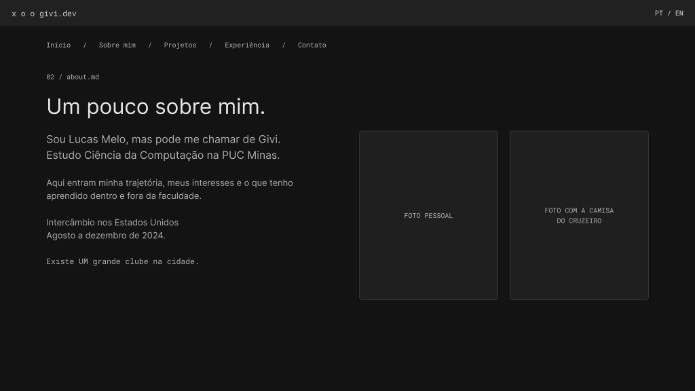
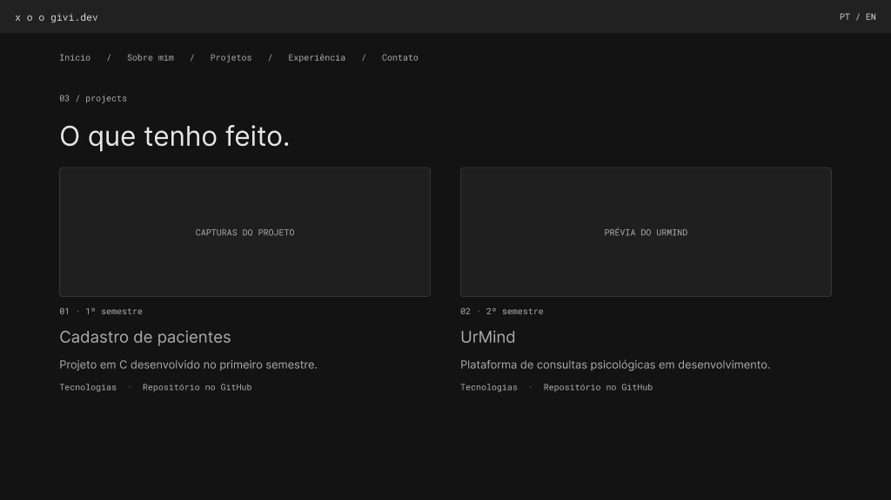

# Givi — Portfólio de Lucas Melo

> Portfólio pessoal desenvolvido para o Laboratório 01 de Desenvolvimento de Interfaces Web, no curso de Ciência da Computação da PUC Minas.

O projeto reúne minha apresentação, habilidades, projetos e experiências. A interface tem inspiração em uma IDE: a home apresenta um explorador de arquivos, um terminal para navegação e um grafo interativo de skills ao redor do nome Givi.

## Status do projeto

A versão atual possui conteúdo em português e inglês, navegação entre seções, projetos em ordem cronológica e formulário integrado ao EmailJS. O envio e o recebimento de mensagens foram confirmados pelo autor em 9 de outubro de 2026.

O UrMind permanece em desenvolvimento. Seu repositório e suas capturas de tela ainda precisam ser adicionados ao portfólio. A versão publicada no GitHub deve acompanhar os arquivos atuais para refletir todas as funcionalidades descritas aqui.

## Índice

- [Links úteis](#links-úteis)
- [Sobre o projeto](#sobre-o-projeto)
- [Funcionalidades principais](#funcionalidades-principais)
- [Tecnologias utilizadas](#tecnologias-utilizadas)
- [Arquitetura](#arquitetura)
- [Instalação e execução](#instalação-e-execução)
- [Deploy](#deploy)
- [Estrutura de pastas](#estrutura-de-pastas)
- [Demonstração e protótipos](#demonstração-e-protótipos)
- [Testes e validação](#testes-e-validação)
- [Documentações e referências](#documentações-e-referências)
- [Autor](#autor)
- [Contribuição](#contribuição)
- [Agradecimentos](#agradecimentos)
- [Licença](#licença)

## Links úteis

- **Site:** [givimelo.github.io](https://givimelo.github.io/)
- **Repositório:** [GiviMelo.github.io](https://github.com/GiviMelo/GiviMelo.github.io)
- **Wireframes:** [Portfolio no Figma](https://www.figma.com/design/RuV35tpCyviDVHhfgdCMnp/Portfolio?node-id=0-1)
- **Projeto em C:** [Clinic Management System](https://github.com/GiviMelo/clinic-management-system)

`givi.dev` é a marca utilizada na interface; o endereço de hospedagem é o indicado acima.

## Sobre o projeto

A proposta foi criar um espaço para apresentar meu percurso na computação, com uma identidade ligada ao apelido Givi. A estética de editor de código conecta o visual ao meu interesse por programação, enquanto as seções tradicionais permitem acessar o conteúdo sem depender do terminal.

O Sobre mim apresenta minha formação na PUC Minas, meus interesses, objetivos e o intercâmbio realizado nos Estados Unidos entre agosto e dezembro de 2024. As fotos e a referência ao Cruzeiro trazem aspectos pessoais para o portfólio.

**Disciplina:** Desenvolvimento de Interfaces Web — DIW.  
**Instituição:** PUC Minas.  
**Professor:** João Paulo Carneiro Aramuni.  
**Atividade:** Laboratório 01 — Portfólio Profissional.

## Funcionalidades principais

- Home inspirada em uma IDE, com dimensões flexíveis e referência de proporção 16:9 em computadores.
- Navegação por menu, explorador de arquivos e terminal.
- Alternância entre português e inglês.
- Terminal com aliases nos dois idiomas, autocomplete e histórico de comandos.
- Grafo de skills em Canvas, com órbita suave, seleção e arraste.
- Transição gradual da estrutura da IDE durante o scroll.
- Scroll entre seções com aceleração e desaceleração suaves.
- Sobre mim com duas fotografias e informações pessoais e acadêmicas.
- Timeline de projetos ordenada por JavaScript, do mais antigo ao mais recente.
- Capturas do cadastro de pacientes e link para seu repositório.
- Experiências acadêmicas e participação em palestra sobre Google Gemini.
- Links de e-mail, LinkedIn e GitHub.
- Formulário com nome, e-mail e mensagem, validação e envio pelo EmailJS.
- Layout responsivo e respeito à preferência de movimento reduzido.

### Comandos do terminal

| Português | Inglês | Ação |
|---|---|---|
| `ajuda` | `help` | Mostra os comandos disponíveis. |
| `inicio` | `home` | Vai para a home. |
| `sobre` | `about` | Vai para Sobre mim. |
| `projetos` | `projects` | Vai para Projetos. |
| `experiencias` | `experience` | Vai para Experiências. |
| `contato` | `contact` | Vai para Contato. |
| `idioma pt` / `idioma en` | `lang pt` / `lang en` | Altera o idioma. |
| `limpar` | `clear` | Limpa a saída do terminal. |
| `listar` | `ls` | Lista as seções. |
| `quemsou` | `whoami` | Mostra a apresentação. |
| `github` | `github` | Apresenta um link para o GitHub. |

Enter executa o comando, Tab completa ou exibe sugestões e as setas para cima e para baixo percorrem o histórico. O terminal reconhece comandos do portfólio; não executa comandos do sistema operacional.

## Tecnologias utilizadas

| Tecnologia ou ferramenta | Versão | Uso |
|---|---|---|
| HTML5 | — | Estrutura semântica e conteúdo. |
| CSS3 | — | Estilos, Grid, Flexbox e responsividade. |
| JavaScript | Nativo do navegador | Navegação, idiomas, terminal, timeline e formulário. |
| Canvas 2D | API do navegador | Grafo interativo de skills. |
| GSAP | 3.13.0 | Animações da interface. |
| ScrollTrigger | 3.13.0 | Animação associada à rolagem. |
| EmailJS | API REST v1.0 | Envio das mensagens do formulário. |
| Figma | — | Wireframes das cinco telas. |
| Git e GitHub | — | Versionamento e repositório. |
| GitHub Pages | — | Hospedagem estática gratuita. |

### Dependências

GSAP e ScrollTrigger são carregados pelo CDN jsDelivr, com a versão fixada no HTML. O formulário utiliza `fetch` para acessar a API do EmailJS, sem SDK instalado. O grafo utiliza somente JavaScript e Canvas.

Não há etapa de compilação, `package.json`, instalação via npm, banco de dados ou servidor de aplicação próprio. A conexão com a internet é necessária para o CDN e para o envio de mensagens. Se o GSAP não carregar, a navegação e o terminal continuam disponíveis.

## Arquitetura

O portfólio é uma aplicação estática de página única. Todas as seções estão em `index.html`; a navegação desloca o visitante até a seção selecionada.

| Arquivo | Responsabilidade |
|---|---|
| `index.html` | Conteúdo, seções, links e formulário. |
| `styles.css` | Identidade visual, layout e ajustes responsivos. |
| `app.js` | Idiomas, navegação, terminal, ordenação dos projetos e integração com GSAP. |
| `scene.js` | Desenho e interação do grafo de skills. |
| `contact-config.js` | Identificadores públicos do EmailJS. |
| `contact.js` | Validação, envio e mensagens de estado do formulário. |

O navegador valida o formulário e envia nome, e-mail e mensagem à API do EmailJS. O serviço processa o template e encaminha o e-mail ao destinatário configurado. Essa escolha permite hospedar o site como arquivos estáticos.

O formulário impede envios simultâneos, apresenta os estados de envio, sucesso e erro, preserva o conteúdo em caso de falha e limpa os campos após um envio bem-sucedido.

## Instalação e execução

### Pré-requisitos

- Navegador atualizado.
- Python 3 para o servidor HTTP local, ou a extensão Live Server do VS Code.
- Git, caso o download seja feito por clonagem.
- Conexão com a internet para animações via CDN e EmailJS.

### Download e execução local

```bash
git clone https://github.com/GiviMelo/GiviMelo.github.io.git
cd GiviMelo.github.io
python3 -m http.server 8000
```

Abra [http://localhost:8000](http://localhost:8000). Para encerrar o servidor, pressione Ctrl+C.

Essas instruções consideram os arquivos do site na raiz do repositório, como no pacote para GitHub Pages. Caso estejam dentro de `dist/`, execute:

```bash
python3 -m http.server 8000 --directory dist
```

Como alternativa, abra a pasta no VS Code e use **Open with Live Server** no arquivo `index.html`. Não é necessário executar `npm install`.

### Configuração do EmailJS

Em `contact-config.js`, a configuração segue esta estrutura:

```javascript
window.CONTACT_EMAILJS = {
  serviceId: 'SEU_SERVICE_ID',
  templateId: 'SEU_TEMPLATE_ID',
  publicKey: 'SUA_PUBLIC_KEY'
};
```

O template recebe os parâmetros `from_name`, `reply_to` e `message`. Configure o destinatário na conta EmailJS e o campo Reply-To como `{{reply_to}}`. Os identificadores usados no navegador são públicos; não coloque senha ou chave privada nesse arquivo.

A configuração atual já foi testada pelo autor. Quem reutilizar o projeto deve configurar seu próprio serviço e template. As instruções adicionais estão em [EMAILJS-SETUP.md](EMAILJS-SETUP.md).

## Deploy

A hospedagem utiliza GitHub Pages, sem etapa de build.

1. Envie os arquivos atuais do site ao repositório, mantendo `index.html` na raiz.
2. Acesse **Settings → Pages**.
3. Selecione **Deploy from a branch**, branch `main` e pasta `/ (root)`.
4. Salve e aguarde a publicação.
5. Abra [https://givimelo.github.io/](https://givimelo.github.io/) e confira o formulário e os links.

Envie também `README.md` e a pasta `docs/` para que as imagens da documentação apareçam no GitHub. Se utilizar uma estrutura com `dist/`, publique seu conteúdo na raiz ou configure um workflow próprio de publicação.

## Estrutura de pastas

A distribuição para GitHub Pages utiliza a seguinte organização:

| Caminho | Conteúdo |
|---|---|
| `README.md` | Documentação do portfólio. |
| `EMAILJS-SETUP.md` | Orientações para configurar o envio de e-mail. |
| `index.html` | Página principal. |
| `styles.css` | Estilos. |
| `app.js` | Comportamentos da interface. |
| `scene.js` | Grafo Canvas. |
| `contact-config.js` | Configuração pública do EmailJS. |
| `contact.js` | Lógica do formulário. |
| `lucas-melo.jpeg`, `lucas-cruzeiro.jpeg` | Fotos do Sobre mim. |
| `cruzeiro-stars.png` | Elemento visual pessoal. |
| `cadastro-menu.png`, `cadastro-paciente.png`, `cadastro-consultas.png` | Capturas do projeto em C. |
| `scene-preview.js`, `scene-fallback.js` | Prévia alternativa preservada; não carregada pela página atual. |
| `docs/wireframes/` | Imagens exportadas dos wireframes. |

## Demonstração e protótipos

Os wireframes são estudos simplificados da organização das telas. A implementação mantém a identidade inspirada em IDE e acrescenta as interações, fotografias e conteúdo definitivo. Os espaços reservados no Figma representam fotos, capturas e campos de formulário.

| Tela | Link direto |
|---|---|
| Home | [Abrir no Figma](https://www.figma.com/design/RuV35tpCyviDVHhfgdCMnp/Portfolio?node-id=9-153) |
| Sobre mim | [Abrir no Figma](https://www.figma.com/design/RuV35tpCyviDVHhfgdCMnp/Portfolio?node-id=11-9) |
| Projetos | [Abrir no Figma](https://www.figma.com/design/RuV35tpCyviDVHhfgdCMnp/Portfolio?node-id=11-32) |
| Experiência | [Abrir no Figma](https://www.figma.com/design/RuV35tpCyviDVHhfgdCMnp/Portfolio?node-id=11-59) |
| Contato | [Abrir no Figma](https://www.figma.com/design/RuV35tpCyviDVHhfgdCMnp/Portfolio?node-id=11-83) |

### Wireframes exportados

| Sobre mim | Projetos |
|---|---|
|  |  |

As exportações de Home, Experiência e Contato ainda devem ser adicionadas a `docs/wireframes/`. As telas já estão disponíveis pelos links acima.

### Projetos apresentados

**Cadastro de pacientes:** sistema em C desenvolvido no primeiro semestre, com cadastro, consulta, edição e exclusão de pacientes e consultas, utilizando structs e persistência em arquivos. As imagens de execução estão na seção Projetos do site.

**UrMind:** projeto em grupo do segundo semestre voltado à busca de profissionais de psicologia e ao agendamento de consultas. Está identificado como em desenvolvimento; o link do repositório e as imagens ainda estão pendentes.

## Testes e validação

O envio real de uma mensagem e seu recebimento por e-mail foram confirmados pelo autor em 09/10/2026. Durante a implementação, os estados de configuração ausente, sucesso e falha do formulário também foram verificados com respostas simuladas.

O pacote não contém uma suíte automatizada de testes. A conferência da versão publicada deve incluir:

- Alternar PT/EN e verificar textos, terminal e descrições do grafo.
- Navegar por menu e terminal; testar autocomplete e histórico.
- Conferir a ordem dos projetos e abrir links e imagens.
- Testar nome vazio, e-mail inválido e mensagem com menos de dez caracteres.
- Enviar uma mensagem válida e confirmar a entrega por e-mail.
- Conferir layout em celular, tablet, computador e com zoom.
- Ativar movimento reduzido e verificar a navegação e o grafo.

### Pendências de conteúdo e entrega

- Adicionar repositório e imagens do UrMind quando disponíveis.
- Exportar as três imagens restantes do Figma e incluí-las no README.
- Sincronizar os arquivos atuais com o repositório e revisar a publicação final.

## Documentações e referências

- [Template de README do professor](https://github.com/joaopauloaramuni/desenvolvimento-de-interfaces-web/blob/main/TEMPLATES/template_README.md).
- [MDN Web Docs](https://developer.mozilla.org/pt-BR/) — HTML, CSS, JavaScript e Canvas.
- [GSAP](https://gsap.com/docs/v3/) e [ScrollTrigger](https://gsap.com/docs/v3/Plugins/ScrollTrigger/).
- [EmailJS — API REST](https://www.emailjs.com/docs/rest-api/send/).
- [GitHub Pages](https://docs.github.com/pt/pages).
- [Portfólio do professor](https://aramuni.dev/) — referência de apresentação de conteúdo.
- Interface de IDE e grafo do Obsidian como referências visuais.

## Autor

**Lucas Rodrigues Givisiez Melo — Givi**  
Estudante de Ciência da Computação na PUC Minas.

- [GitHub](https://github.com/GiviMelo)
- [LinkedIn](https://www.linkedin.com/in/lucasrgmelo)
- [E-mail](mailto:lgmelo01@gmail.com)

## Contribuição

Sugestões podem ser registradas nas issues do repositório. Para propor mudanças, crie uma branch, preserve a identidade visual e confira a navegação, os dois idiomas e a responsividade antes de abrir um pull request.

## Agradecimentos

Ao professor João Paulo Carneiro Aramuni, pela proposta do laboratório e pelo template de documentação, e à PUC Minas pelo contexto acadêmico do projeto.

## Licença

Nenhuma licença de distribuição foi definida nesta versão. Fotografias e elementos pessoais não devem ser reutilizados sem autorização do autor.
